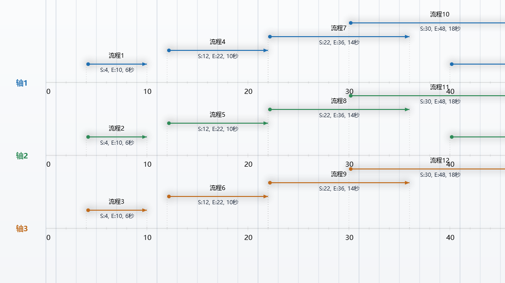

# 功能流程图编辑器（ProcessFlowDesigner）

> 把设备 / 产线的**动作顺序**画成时间轴上的流程条 ——
> 一眼看出**总时长**、**哪一步卡着**、**哪几步能并行**。

**➜ [点这里下载最新版](../../releases/latest)（44 MB · 双击安装 · 不需要装 .NET · 不需要管理员权限）**

适用：**作业循环分析 · 节拍分析 · 动作时序梳理 · 工艺文件配图**
（工程机械 / 产线设备 / PLC 时序 / 设备动作说明书）

Windows 桌面软件（Windows 10 / 11，64 位）。**本仓库只提供安装包，不含源码。**

上图是程序自带的示例（**流程1 / 流程2 …**），不是任何真实项目的图纸。
缩放有两种语义：**保真**（缩放只改变时间轴疏密、字号保持可读，适合对时间、看全局）与
**等比**（整张图按比例放大，适合看细节）—— 见 `样张/缩放模式-保真.png`、`样张/缩放模式-等比.png`。

---

## 它解决什么问题

写工艺、做设备调试的时候，动作顺序常常只能靠一张 Excel 表或者一段文字描述：

> "先低位待机 18 秒 → 大臂变幅回位 10 秒 → 开夹钳 4 秒 → 锥头 40° 坡道 6 秒 ……"

一旦有几十上百个动作、还要看"哪几个动作能并行、哪一步卡住了总时长"，表格就不够用了。
这个工具把这堆动作**直接画成时间轴上的条**：

- 一眼看出**总时长**和**每一步的起止**；
- 一眼看出**哪里是空的**（设备在等）、**哪里挤在一起**；
- 用**链接**表达动作之间的前后关系，挪一个，后面的跟着走；
- 需要的场合能**导出 PDF / 打印**（装不下会自动分成多页，不会把图裁掉）。

**适用场景**：工程机械（挖掘机、桩机、装载机…）的作业循环分析、产线节拍平衡、
PLC / 时序逻辑梳理、设备动作说明书配图、工艺流程培训材料。

---

## 主要功能

- **画**：新建轴 = 新建一行；在轴上拖出流程条，拖两端改长度、拖中间整体挪；名称、颜色、字体、对象样式（线段 / 矩形 / 胶囊 / 箭头 / 双线…）随你调
- **链接**：把两个流程的先后关系连起来，父的一动，下游自动跟着对齐
- **对象树 + 筛选**：左侧按"轴 → 流程"列出来，格式是 `名称（S:起点,E:终点,D:时长+单位）`；
  顶部有**快速筛选框**（边打边筛）和条件对话框（按名称 / 轴 / 时长 / 起点 / 样式）
- **缩放**：滚轮缩放（锚定鼠标位置，缩放到哪就停在哪儿）；两种缩放语义 —— **保真**（缩放只改变时间轴疏密，字号保持可读）和**等比**（整张图按比例放大，看细节用）
- **导出 / 打印**：导出图像、导出 PDF；**打印与导出一致，装不下自动分多页拼接**
- **打开方式**：双击 `.wxlg` 图纸直接打开；也支持把图纸文件**拖进窗口**
- **其它**：撤销/重做、复制粘贴、批量筛选修改、查找定位、世界属性（背景 / 单位 / 投影线颜色…）、
  全部界面设置（显示开关、透明度、风格、字号、面板宽度…）都会记住

---

## 下载与安装

到本仓库的 **Releases** 页面（或直接下载仓库里的安装包）：

**`ProcessFlowDesigner-Setup-2.0.0.exe`**（约 45 MB，含运行环境，**不需要另外装 .NET**）

双击安装即可，**不需要管理员权限** —— 程序默认装到
`%LOCALAPPDATA%\Programs\ProcessFlowDesigner`（安装向导里可以改成别的盘）。

安装时有两个可选项：

- **创建桌面快捷方式**
- **把 `.wxlg` 流程文件关联到本程序**（勾上以后，双击图纸就直接用本编辑器打开）

卸载：开始菜单 →「卸载 功能流程图编辑器」，或 Windows 设置 → 应用。
**卸载不会动你画好的图纸和设置。**

> 首次运行时 Windows 可能弹"已保护你的电脑 → 更多信息 → 仍要运行"（没有买代码签名证书，
> 这是所有个人开发者软件的常态）。程序不联网、不写系统目录、开机不自启。

---

## 快速上手

1. 打开程序 → 默认已经有一根轴（一行）。选「新加流程」在轴上拖出一个流程条。
2. 点中流程条，右侧属性栏改**名称、起止位置、时长、颜色、字体、对象样式**。
3. 需要多行就「新建轴」；轴的上下位置可以拖，横向是时间刻度。
4. 要表达"这个动作结束后那个动作才开始"：选中前一个 → 点「链接」→ 点目标流程的**头部或尾部 20% 区域**。
5. 画完「文件 → 导出为 PDF」或直接「打印」；内容超过一页会自动分页。

图上的横轴单位（秒 / 分 / 米 …）在**世界属性 → 单位**里改，左侧对象树和画布标注会跟着变。

---

## 数据文件

| 后缀 | 说明 |
|---|---|
| `.wxlg` | 当前格式（V2） |
| `.al` | 早期格式（V1），仍然可以打开 |

数据格式与老版本（GDI+ 版）**完全兼容**：老图纸能打开，新存的文件老版本也能读。

---

## 常见问题

**Q：双击图纸没反应 / 打开的窗口是空的？**
A：先确认 `.wxlg` 关联指向的是本程序：程序里「帮助 → 关联后缀名（.wxlg）」点一下即可。
如果之前装过别的版本，Windows 会把关联指到旧的那份，重新点一次就能改过来。

**Q：装到哪个盘？**
A：默认装到用户目录（不需要管理员）。想装到 D 盘等其他位置，安装向导第二步自己选路径就行。

**Q：杀毒软件报毒？**
A：程序做过代码混淆（防止被人拿去改个名字就说是自己的），部分杀软对混淆过的 .NET 程序会误报。
程序不联网、不修改系统设置（除了你勾选的 `.wxlg` 关联，那也写在当前用户下）。

**Q：为什么这么大？**
A：约 45 MB 是**压缩后**的体积，里面包含完整的 .NET 运行环境 —— 换来的是你**不需要另外装任何东西**，拷过去就能用。

---

## 反馈

用 GitHub 的 [Issues](../../issues) 提问题或建议。提问题时如果能附上图纸文件（或截图）会更快定位。

---

## 关键词

功能流程图 · 工序流程图 · 动作顺序图 · 时间轴流程图 · 甘特图风格 · 作业循环分析 · 节拍分析 ·
时序图工具 · 工程机械 · 挖掘机 · 桩机 · 装载机 · PLC 时序 · 设备动作说明 · 工艺流程配图 ·
流程编辑器 · Windows 桌面软件 · 免费 · .wxlg · 流程图绘制工具
